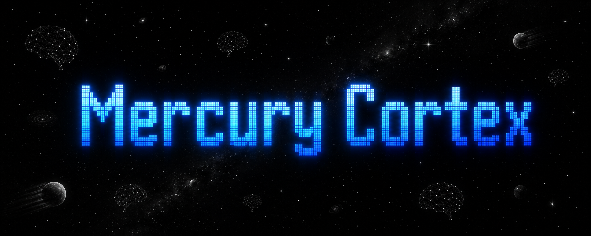

<div align="center">



**A local-first knowledge engine for AI coding assistants.**

It works with any MCP-compatible AI assistant, including Claude Code, OpenCode, Gemini CLI, Copilot CLI, and others.

[](https://www.rust-lang.org/)
[](https://modelcontextprotocol.io/)
[](LICENSE)

</div>

---

## Why Mercury Cortex?

AI coding assistants are powerful, but they lack persistent memory. Every new conversation starts from zero — they don't remember your project's architecture, past decisions, or codebase patterns. This forces you to repeatedly re-explain context, losing time and breaking flow.

Mercury Cortex fills this gap. Your AI describes what it builds, imports that metadata into a structured knowledge graph, and serves that context to any MCP-compatible AI assistant. When you return to a project after weeks, your AI partner remembers everything — file relationships, code patterns, and project history.

The engine runs locally on your machine. Your code never leaves your device, and the knowledge graph is built from your actual project files, not a cloud service. Connect it once, and every AI tool you use gains the same persistent project understanding.

[Know more →](#features--vision)

## Quick Start

### 1. Initialize the environment

Creates the data directory, database, and applies schema migrations.

```bash
mercury-cortex setup
```

### 2. Create your profile

Interactive prompts for your name, email, and agent name.

```bash
mercury-cortex profile
```

### 3. Register your project

Registers the current directory and creates `.mercury-cortex/` config.

```bash
cd my-project
mercury-cortex project
```

### 4. Connect your AI tool

Add the MCP server configuration to your AI tool (see [Connect Your AI Tool](#connect-your-ai-tool) below for tool-specific examples).

### 5. Start indexing

In your AI chat, type:

```
mercury-cortex:init
```

The AI registers the project, analyzes its structure, generates metadata for every file, and imports it into the knowledge graph. After this, your AI has full context of the project. See [Workflows](#workflows) for details.

### 6. Start developing

Once indexing is complete, use `mercury-cortex:dev` as a prefix to your normal development requests:

```
mercury-cortex:dev

Create light, dark, and system themes.
```

The AI searches the knowledge graph before writing code, reuses existing patterns, and updates the index with new files. Use it for any task — bug fixes, features, refactoring. See [Workflows](#workflows) for details.

## Connect Your AI Tool

### OpenCode

```json
{
  "mcp": {
    "mercury-cortex": {
      "type": "local",
      "command": ["mercury-cortex", "mcp", "serve"],
      "enabled": true
    }
  }
}
```

### Claude Code

```json
{
  "mcpServers": {
    "mercury-cortex": {
      "command": "mercury-cortex",
      "args": ["mcp", "serve"]
    }
  }
}
```

### Codex

```toml
[mcp_servers.mercury-cortex]
command = "mercury-cortex"
args = ["mcp", "serve"]
```

### Google Antigravity

```json
{
  "mcpServers": {
    "mercury-cortex": {
      "command": "mercury-cortex",
      "args": ["mcp", "serve"]
    }
  }
}
```

## Workflows

Mercury Cortex provides two workflows (called "prompts" in MCP) that guide your AI through structured tasks. Both are triggered from your AI chat — not from the terminal.

### `mercury-cortex:init` — Project Initialization

**When to use:** Once, when first setting up a project with Mercury Cortex.

**How to use:** Type `mercury-cortex:init` in your AI chat. The AI calls the MCP prompt and follows a 5-step workflow:

1. **Prerequisites and Validation** — Verifies the project is registered and the engine is reachable.
2. **Project Analysis** — Detects languages, frameworks, and project structure.
3. **`.mcignore` Refinement** — Reviews and updates exclusion patterns (e.g., `target/`, `build/`, `.env`).
4. **Metadata Generation and Import** — Generates metadata for source files, writes JSON to `.mercury-cortex/temp/`, and imports via `metadata/import`.
5. **Verification and Summary** — Confirms the index is populated and reports results.

After initialization, every source file's purpose, features, tags, and exports are searchable by your AI.

### `mercury-cortex:dev` — Development Workflow

**When to use:** During day-to-day development. Use this alongside your normal prompts — ask it to analyze, implement, or refactor, and it will search the knowledge graph before writing code.

**How to use:** Prefix your normal development requests with `mercury-cortex:dev`:

```text
mercury-cortex:dev

Create light, dark, and system themes.
```

```text
mercury-cortex:dev

Refactor the auth middleware to support JWT tokens.
```

```text
mercury-cortex:dev

Fix the race condition in the connection pool.
```

The AI follows a 7-step workflow:

0. **About Mercury Cortex** — Reviews available tools and capabilities.
1. **Analyze the Request** — Breaks down what you're asking for.
2. **Search Mercury Cortex** — Queries the knowledge graph for relevant existing code.
3. **Decide: Reuse, Extend, or Create** — Determines whether to reuse existing code, extend it, or write something new.
4. **Implement Changes** — Makes the code changes.
5. **Generate and Submit Metadata** — Updates the knowledge graph with the new or changed files.
6. **Report** — Summarizes what was done.

The dev workflow ensures your AI always searches before writing, reuses before creating, and keeps the knowledge graph current.

## MCP Tools Reference

| Tool | Description |
|------|-------------|
| `cortex/info` | Engine version and status |
| `project/open` | Open a project in the engine |
| `project/close` | Close the active project |
| `project/status` | Current project state |
| `project/register` | Register a new project |
| `project/update` | Save AI-generated project metadata |
| `project/update_mcignore` | Append ignore patterns to `.mcignore` |
| `search/code` | Search indexed file metadata |
| `metadata/import` | Import staged AI-generated metadata |
| `index/paths` | Index project file paths |
| `file/metadata` | Get file metadata |
| `workflow/session` | Start a workflow session |
| `workflow/step` | Execute a workflow step |

## CLI Reference

| Command | Description |
|---------|-------------|
| `mercury-cortex setup` | Initialize global environment, DB, and schema |
| `mercury-cortex migration` | Run database schema migrations |
| `mercury-cortex profile` | Create or update user profile |
| `mercury-cortex project` | Register the current project directory |
| `mercury-cortex mcp serve` | Start MCP server over stdio |
| `mercury-cortex mcp stop` | Stop all running MCP server processes |
| `mercury-cortex daemon serve` | Start daemon with IPC server on Unix socket |
| `mercury-cortex daemon stop` | Stop the running daemon |
| `mercury-cortex db backup` | Create a timestamped database backup |
| `mercury-cortex db list` | List available database backups |
| `mercury-cortex db restore` | Restore the database from a backup |
| `mercury-cortex db reset` | Clear all schema tables |
| `mercury-cortex db export` | Export table data to JSON files |
| `mercury-cortex version` | Print version, build info, and commit hash |

See [docs/commands.md](docs/commands.md) for the full commands reference with flags, arguments, and examples.

## Project Layout

### `.mercury-cortex/`

Per-project configuration directory:

```
.mercury-cortex/
  config.json     # Project-specific settings
  .mcignore       # Files to exclude from indexing
  temp/           # Staged AI-generated metadata for import
```

### `AGENTS.md` / `CLAUDE.md`

Optional project-level instruction files that AI assistants read to understand your project conventions.

## Architecture

Mercury Cortex is built around these components:

- **Runtime** — Coordinates the engine, project state, and IPC
- **Engine** — Knowledge graph operations (see `mercury-cortex-core`)
- **MCP Server** — Implements the Model Context Protocol over stdio
- **IPC Server** — Unix socket daemon for process communication
- **Database** — SurrealDB with local file storage

For the core library internals, see [`mercury-cortex-core`](https://github.com/mercury-ai-1/mercury-cortex-core).

## Features & Vision

### Available Today

- **Local-first knowledge engine** — Your code never leaves your machine. The knowledge graph is built from your actual project files, stored in a local SurrealDB database.
- **MCP server** — Implements the Model Context Protocol over stdio, connecting your AI assistant to the knowledge graph. Works with OpenCode, Claude Code, Codex, Gemini CLI, and other MCP-compatible tools.
- **AI workflows** — Two built-in workflows guide your AI through structured tasks:
  - `mercury-cortex:init` — One-time project setup: registers the project, analyzes structure, generates metadata for every file, and imports it into the knowledge graph.
  - `mercury-cortex:dev` — Day-to-day development: searches the knowledge graph before writing code, reuses existing patterns, and keeps the index current.
- **Project registration** — Register any project directory with a single command. Creates `.mercury-cortex/` config, `.mcignore` patterns, and AI instruction files.
- **Metadata import** — The AI generates structured metadata (purpose, features, tags, exports) for source files and imports it into the knowledge graph via `metadata/import`.
- **Semantic search** — Search indexed file metadata by purpose, features, language, or framework — not just filenames.
- **Database management** — Backup, restore, reset, and export your knowledge graph with `mercury-cortex db` commands.
- **CLI** — Full command-line interface for setup, profile management, project registration, MCP server control, daemon management, and database operations. See [docs/commands.md](docs/commands.md) for the complete reference.

### Long-Term Vision

Mercury Cortex is designed to evolve from a personal AI knowledge engine into an **organization-wide AI knowledge platform**. The long-term vision includes:

- **Organization knowledge sharing** — Teams share a common knowledge graph across repositories, so every developer's AI has access to the same institutional knowledge.
- **Multi-agent collaboration** — Multiple AI agents work together on shared tasks, coordinating through the knowledge graph to avoid conflicts and duplication.
- **AI-to-AI communication** — AI assistants in different projects or sessions discover and reference each other's work through the knowledge graph.
- **Knowledge ownership discovery** — Automatically identify who wrote what, who maintains which modules, and where expertise lives in the organization.
- **Cross-project knowledge graph** — A unified graph connecting files, modules, and patterns across all registered projects, enabling reuse at scale.
- **Context sharing between AI agents** — AI agents pass context to each other through the knowledge graph, maintaining continuity across sessions and tools.
- **Intelligent code ownership detection** — Automatically detect code ownership, responsibility boundaries, and dependency relationships across the codebase.
- **Team knowledge network** — A network of project knowledge graphs that surfaces relevant patterns, decisions, and conventions across the entire team.

> *These capabilities represent the long-term vision of Mercury Cortex and are not part of the current release.*

## Development

```bash
# Requires Rust 1.85+ (edition 2024)
# Core library must be a sibling directory
git clone https://github.com/mercury-ai-1/mercury-cortex.git
git clone https://github.com/mercury-ai-1/mercury-cortex-core.git ../mercury-cortex-core

cargo build
cargo test
cargo clippy -- -D warnings
```

See [CONTRIBUTING.md](CONTRIBUTING.md) for details.

## Security

See [SECURITY.md](SECURITY.md) for information about reporting vulnerabilities and the threat model.

## Contributing

See [CONTRIBUTING.md](CONTRIBUTING.md) for development setup, workflow, and guidelines.

## License

Apache-2.0 — Copyright 2026 Mercury Cortex Contributors. See [LICENSE](LICENSE) for details.
